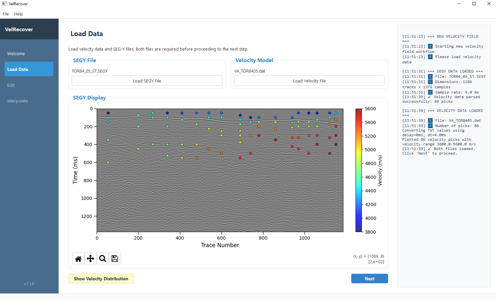
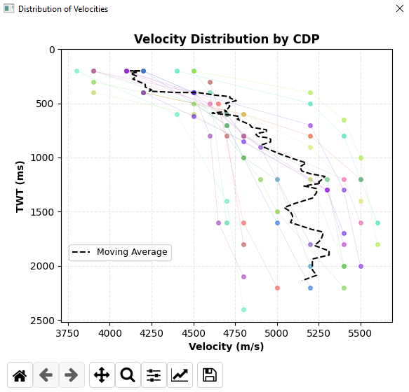
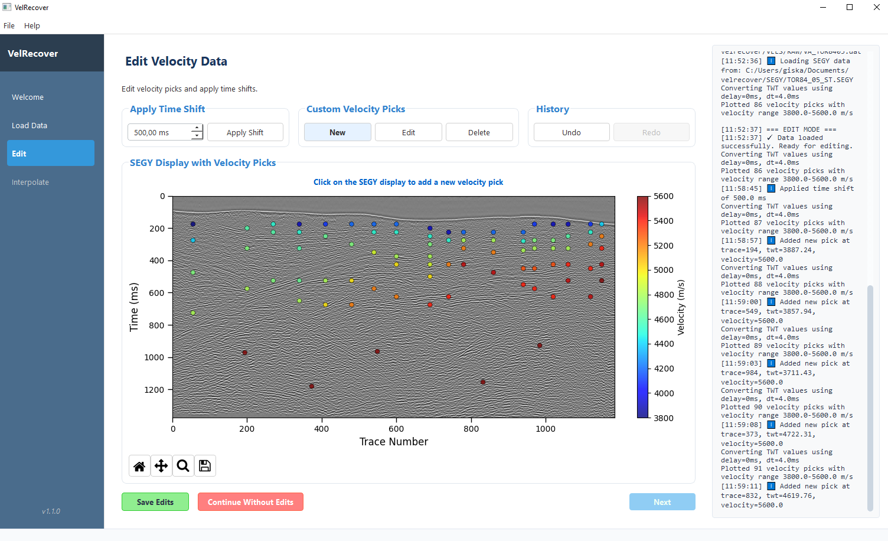
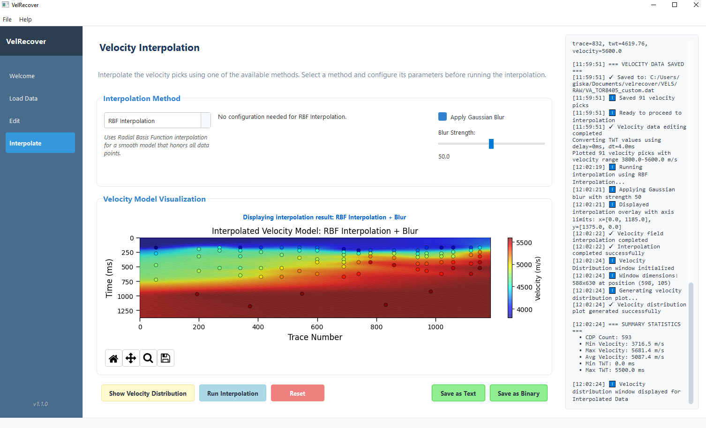

# VelRecover

[](https://doi.org/10.5281/zenodo.15053268)


[](https://www.gnu.org/licenses/gpl-3.0.en.html)
[](https://www.python.org/downloads/)

A Python tool for building velocity models from the interpolation of sparse velocity picks found in seismic sections. VelRecover provides multiple interpolation algorithms in an intuitive GUI for visualization and quality control.

VelRecover is part of a collection of open source tools to digitize and enhance vintage seismic sections. See https://a-pertuz.github.io/REVSEIS/ for more information.

<details open>
<summary><h2>📖 Table of Contents</h2></summary>

- [Features](#features)
- [System Requirements](#system-requirements)
- [Installation](#installation)
- [Before You Begin](#before-you-begin)
- [Quick Start (6 Steps)](#quick-start-6-steps)
- [Complete Tutorial](#complete-tutorial)
- [Interpolation Methods](#interpolation-methods)
- [Troubleshooting and FAQs](#troubleshooting-and-faqs)
- [Citation](#citation)
- [License](#license)

</details>

<details open>
<summary><h2>✨ Features</h2></summary>

- **Multiple Interpolation Methods** - Linear, logarithmic, RBF, and two-step interpolation algorithms
- **Velocity Editing** - Tools to add, modify, and delete velocity picks
- **Gaussian Smoothing** - Apply adjustable smoothing to interpolated velocity models
- **Multiple Export Formats** - Save velocity models as text or binary files
- **Velocity Distribution Analysis** - Analyze velocity trends and distributions
- **User-friendly GUI** - Simple workflow with visual guidance for the entire velocity modeling process

</details>

<details>
<summary><h2>💻 System Requirements</h2></summary>

- **Operating System**: Windows, Linux, or macOS
- **Memory**: At least 4GB RAM
- **Python**: 3.8+ (automatically handled if installing via pip)
- **Disk Space**: Sufficient space for velocity data and output files
- **Data Requirements**: 
  - Velocity data files with 3 columns (CDP, TWT, Velocity)
  - SEG-Y files for spatial context (optional but recommended)

</details>

<details>
<summary><h2>⚙️ Installation</h2></summary>

### Windows Installation

1. **Install Python** (if not already installed):
   - Download Python from [python.org](https://www.python.org/downloads/windows/)
   - During installation, make sure to check **"Add Python to PATH"**
   - Click "Install Now" and wait for installation to complete

2. **Install VelRecover**:
   - Open Command Prompt (search for "cmd" in Windows search)
   - Type the following command and press Enter:

   ```bash
   pip install velrecover
   ```

   Alternatively, install directly from GitHub:
   ```bash
   pip install git+https://github.com/a-pertuz/velrecover.git
   ```

3. **Launch the program**:
   After installation, simply type:
   ```bash
   velrecover
   ```

### First Run Setup

When you run VelRecover for the first time:

- You'll be prompted to choose a data storage location
- Example files will be copied to your selected location
- The application will create the necessary folder structure

### Creating a Desktop Shortcut

1. Right-click on your desktop
2. Select "New" → "Shortcut"
3. Type `velrecover` (if installed via pip)
4. Click "Next" and give the shortcut a name (e.g., "VelRecover")
5. Click "Finish"

</details>

<details>
<summary><h2>📁 Before You Begin</h2></summary>

### File Organization

VelRecover uses the following folder structure:

```
velrecover/
├── SEGY/                 # Store seismic SEGY files
├── VELS/                 # Main velocity data directory
│   ├── RAW/              # Store input velocity data files
│   ├── CUSTOM/           # Store edited velocity picks
│   └── INTERPOLATED/     # Store interpolated velocity models
│       ├── TXT/          # Text format outputs
│       └── BIN/          # Binary format outputs
└── LOG/                  # Store log files
```

The application automatically creates these folders if they don't exist.

### Prepare Your Data

1. **Place velocity files** in the `VELS/RAW/` folder
2. **Place SEGY files** in the `SEGY/` folder (optional but recommended)
3. **Verify data format**:
   - Velocity files: Text files with 3 columns (CDP, TWT, Velocity)
   - Example format:
     ```
     CDP    TWT    Velocity
     100    500    1500
     200    1000   1800
     300    1500   2100
     ```
   - SEGY files: Standard SEG-Y format for corresponding seismic lines

</details>

<details open>
<summary><h2>🚀 Quick Start (6 Steps)</h2></summary>

1. **Launch** → Run `velrecover` and click "Start New Project"
2. **Load Data** → Load velocity text file and SEGY file
3. **Edit** → Review and edit velocity picks if needed
4. **Select Method** → Choose interpolation algorithm
5. **Interpolate** → Run interpolation and apply smoothing if desired
6. **Export** → Save velocity model in desired format

Your velocity model will be saved in the `VELS/INTERPOLATED/` folder and can be used for seismic processing and interpretation.

</details>

<details open>
<summary><h2>📚 Complete Tutorial</h2></summary>

### Step 1: Loading Velocity Data


*Window for loading velocity data and SEGY files*

1. From the Welcome screen, click **"New Velocity Field"** button
2. In the **Load Data** tab:
   - Click **"Load SEGY File"** to provide spatial context for the interpolation
   - Click **"Load Text File"** to select your velocity data file (formats: .dat, .txt, .tsv, .csv)
   - The velocity picks will be loaded and displayed over the SEG-Y file
   - Click **"Show Velocity Distribution"** to visualize the distribution of velocity values
   - Click **"Next"** to proceed to the Edit tab


*Velocity distribution plot showing the velocity values vs two-way-time for each trace or CDP in the text file*

> **Note**: Click the **"Show Velocity Distribution"** button to visualize the distribution of velocity values in your data. This can help identify outliers or trends in the data.

### Step 2: Editing Velocity Data


*Data editing interface for cleaning velocity data. New picks have been added at the seismic section bottom.*

In this step, you'll review and edit your velocity data to remove outliers or incorrect velocity picks. You can also add new picks to improve the accuracy of the model:

1. **Apply Time Shift**: Click to shift all velocity picks along the time axis
2. **Edit Pick**: Select a pick and modify its velocity value
3. **Add Pick**: Add new velocity picks at selected Trace and TWT positions
4. **Delete Pick**: Remove selected velocity picks
5. **Save Changes**: 
   - Click **"Save edits"** and select save location for new velocity picks
   - Click **"Continue without edits"** if no changes are needed
6. Click **"Next"** to proceed to interpolation

> **Tip**: Adding picks at depth intervals where velocity changes significantly improves interpolation accuracy.

### Step 3: Interpolation


*Interpolation interface showing the velocity field visualization*

Configure and run the interpolation to generate a complete velocity field:

1. **Select Interpolation Method** from the dropdown:
   - **Linear Best Fit**: Simple linear model (V=V0+kt)
   - **Linear Custom**: Custom linear model with user-defined coefficients
   - **Logarithmic Best Fit**: Natural logarithmic model for compaction effects
   - **Logarithmic Custom**: Custom logarithmic model (V=V0+k*ln(t))
   - **RBF**: Radial Basis Function for smooth transitions
   - **Two-Step**: RBF interpolation followed by nearest neighbor filling

2. **Configure Parameters** (method-specific):
   - For custom methods: Set V0 and k coefficients
   - For RBF: Choose basis function type
   - For Two-Step: Set interpolation parameters

3. **Run Interpolation**: Click **"Run Interpolation"** to process the data

4. **Apply Smoothing** (optional):
   - Enter Gaussian blur value (1-100)
   - Higher values provide more smoothing
   - Click **"Run Interpolation"** again to apply

5. **Review Results**: The velocity field displays as a color-coded grid

6. **Export Results**:
   - **"Save Data as TXT"**: Exports as a text file with X, Y coordinates and CDP, TWT, Velocity values
   - **"Save Data as BIN"**: Exports in binary format (float32) as a velocity grid (TWT, CDP)

> **Note**: Binary format (.bin) is suitable for direct import into Seismic Unix for migration processing. Text format (.txt) can be imported into most interpretation software.

### Step 4: Results and Export

- **Text Format (.txt)**: Compatible with most interpretation software (Petrel, Kingdom, OpendTect)
- **Binary Format (.bin)**: Direct import into Seismic Unix for migration processing
- Files are automatically saved in the appropriate `VELS/INTERPOLATED/` subdirectories

</details>

<details>
<summary><h2>🔧 Interpolation Methods</h2></summary>

### Linear Models

**Linear Best Fit**
- **Description**: Simple linear model based on best fit for all velocity picks (V=V0+kt)
- **Best for**: Simple velocity fields with gradual changes
- **Advantages**: Fast computation, predictable results
- **Limitations**: May not accurately represent natural velocity trends with depth

**Linear Custom**
- **Description**: Create custom linear model by defining V0 and k coefficients
- **Best for**: When you have prior knowledge of velocity trends
- **Usage**: Enter V0 (initial velocity) and k (gradient) values

### Logarithmic Models

**Logarithmic Best Fit**
- **Description**: Model based on natural logarithmic best fit for all velocity picks
- **Best for**: Simple velocity fields accounting for compaction effects
- **Advantages**: Better represents natural velocity behavior
- **Limitations**: May create unusual values at surface; apply Gaussian blur for better results

**Logarithmic Custom**
- **Description**: Create custom logarithmic model (V=V0+k*ln(t))
- **Best for**: Areas with known compaction trends
- **Usage**: Define V0 and k coefficients based on geological understanding

### Advanced Methods

**RBF (Radial Basis Function)**
- **Description**: Uses radial basis functions to create smooth interpolation surfaces
- **Best for**: Complex velocity fields with irregular sampling
- **Advantages**: Creates natural-looking transitions between sparse points
- **Limitations**: Computationally intensive; may create anomalous gradients without sufficient picks
- **Recommendation**: Add picks at depth to guide interpolation

**Two-Step Interpolation**
- **Description**: First interpolates each trace with velocity picks using RBF, then completes model using nearest neighbor
- **Best for**: Areas with complex geology and lateral velocity variations
- **Advantages**: Handles both lateral and vertical trends effectively
- **Limitations**: Most computationally intensive method


</details>

<details>
<summary><h2>🔧 Troubleshooting and FAQs</h2></summary>

### Troubleshooting

#### Data Loading Issues
- Ensure your text file has exactly 3 columns: CDP, TWT, Velocity
- Leave only one line of comments or headers
- Verify all values are numeric with no text characters
- Check that CDP numbers are reasonable (positive integers)

#### Interpolation Artifacts
- Edit out obvious outliers in your velocity data
- Try different interpolation methods
- Apply Gaussian blur to smooth small-scale artifacts
- Add more velocity picks in areas with poor results

#### Poor Interpolation Results
- **Linear/Logarithmic**: May not suit complex geology; try RBF or Two-Step
- **RBF**: Add more picks at depth; may need smoothing
- **Two-Step**: Computationally intensive but usually most realistic


### Common Issues
- **Program not found**: Ensure Python is added to your PATH
- **Missing dependencies**: Try running `pip install <package_name>`

</details>

<details>
<summary><h2>📄 Citation</h2></summary>

If you use this software in your research, please cite it as:

```
Pertuz, A., Benito, M. I., Llanes, P., Suárez-González, P., & García-Martín, M. (2025b). VelRecover: a Python GUI-based tool for creating velocity models from sparse 2D velocity picks in vintage seismic reflection sections. Zenodo. https://doi.org/10.5281/zenodo.15053268
```

Check the Zenodo repository: https://doi.org/10.5281/zenodo.15053268

</details>

<details>
<summary><h2>⚖️ License</h2></summary>

This software is licensed under the GNU General Public License v3.0 (GPL-3.0).

You may copy, distribute and modify the software as long as you track changes/dates in source files. 
Any modifications to or software including (via compiler) GPL-licensed code must also be made available 
under the GPL along with build & installation instructions.

For the full license text, see [LICENSE](LICENSE) or visit https://www.gnu.org/licenses/gpl-3.0.en.html

</details>

---

*For questions, support, or feature requests, please contact Alejandro Pertuz at apertuz@ucm.es*
